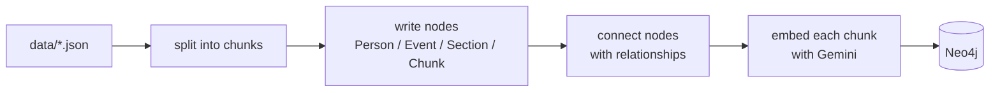
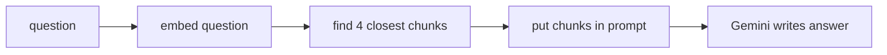
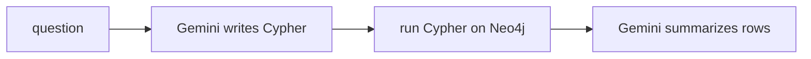

# Flow

Two phases: **load data in** (`prep.ipynb`), then **ask questions** (`main.ipynb`).

---

## 1. Ingestion — getting data into Neo4j



### In plain words

1. **Read the JSON.** Each file (`Napoleon.json`, etc.) is `{ "section name": "long text" }`.
2. **Chunk it.** Long text is cut into ~2000-character pieces so it fits an embedding model.
3. **Create nodes:**
   - one `Person` or `Event` node per file,
   - one `Section` node per JSON key,
   - one `Chunk` node per text piece.
4. **Create relationships** (`Section`→`Chunk`, `Person`→`Section`, `Person`→`Event`, …).
5. **Embed chunks.** For every `Chunk`, send its text to Gemini, get back 768 numbers (a vector), store it on the node.

### The code

| Step | Function | File |
|---|---|---|
| chunk | `split_data_from_file` | `KG/chunking.py` |
| nodes | `create_nodes`, `ingest_Chunks` | `KG/kg.py` |
| relationships | `create_relationship` | `KG/kg.py` |
| index + embeddings | `create_vector_index`, `embed_text` | `KG/kg.py` |
| run everything | `prep.ipynb` | — |

```python
# prep.ipynb, simplified
graph, gemini_api, _ = load_neo4j_graph()

for name in ["Talleyrand", "Napoleon", "Battle_of_Waterloo"]:
    chunks = split_data_from_file(f"data/{name}.json")   # 1 + 2
    data   = json.load(open(f"data/{name}.json"))
    label  = "Event" if name == "Battle_of_Waterloo" else "Person"
    create_nodes(graph, data, label, name)               # 3
    ingest_Chunks(graph, chunks, name, "Chunk")          # 3

for q in relationship_queries:
    create_relationship(graph, q)                        # 4

create_vector_index(graph, "Chunk")                      # 5
embed_text(graph, gemini_api, "Chunk", batch_size=32)    # 5
```

---

## 2. Vector RAG — answer from chunk text



### In plain words

1. Turn the question into a vector (same Gemini model used for chunks).
2. Ask Neo4j for the 4 chunks whose vectors are closest.
3. Paste those 4 chunk texts into a prompt.
4. Gemini answers using only that text.

### The code

```python
# vectorRAG.py, simplified
def query_vector_rag(question, ...):
    store = Neo4jVector.from_existing_graph(embedding=Gemini(...), ...)   # 1 setup
    chunks = store.as_retriever(search_kwargs={"k": 4}).invoke(question)  # 1 + 2
    context = "\n\n".join(c.page_content for c in chunks)                 # 3

    prompt = "Answer using only this context:\n{context}\n\nQ: {input}"
    chain  = prompt | Gemini("gemini-3.6-flash") | StrOutputParser()
    return chain.invoke({"context": context, "input": question})          # 4
```

---

## 3. Graph RAG — answer with a generated query



### In plain words

1. Give Gemini the graph schema + the real node names, ask it to write a Cypher query.
2. Run that query against Neo4j.
3. Give the resulting rows back to Gemini to phrase as an answer.

### The code

```python
# GraphRAG.py, simplified
def generate_cypher_query(question, graph):
    names  = _entity_name_catalog(graph)          # real Person/Event names
    prompt = PromptTemplate(template=CYPHER_TEMPLATE, ...)  # includes schema + names

    chain = GraphCypherQAChain.from_llm(
        Gemini("gemini-3.6-flash"),
        graph=graph,
        cypher_prompt=prompt,
        allow_dangerous_requests=True,             # LLM-written Cypher runs on the DB
    )
    return chain.invoke({"query": question})["result"]   # steps 1-3 happen inside
```

---

## 4. Which one to use

| Ask this way | Use |
|---|---|
| "What did Napoleon reform?" (facts in prose) | **Vector RAG** |
| "How many Person nodes?" / "Who is linked to Waterloo?" (structure) | **Graph RAG** |

Vector RAG sees anything written in the text (even people with no node, like
Wellington). Graph RAG only knows the nodes you built, but its answers are exact.
The planned next step is to run both and feed both results into one final prompt.
