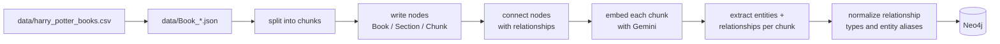
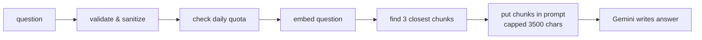
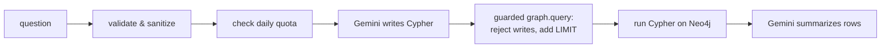
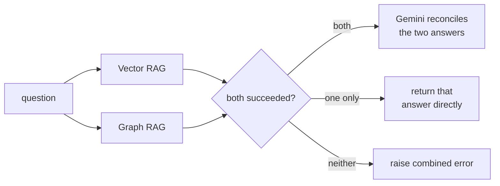

# Flow

Two phases: **load data in** (`prep.ipynb`), then **ask questions** (`main.ipynb`).

---

## 1. Ingestion — getting data into Neo4j



### What happens at each step

| # | Step | Function / file | Tool used | Details |
|---|------|-----------------|-----------|---------|
| 0 | CSV -> per-book JSON (one-off, not in `prep.ipynb`) | `KG/csv_to_json.py` | Python stdlib `csv`/`json` | groups `harry_potter_books.csv` rows by `book` then `chapter`, joins each chapter's rows into one text blob |
| 1 | Read the JSON | `open() + json.load` in `split_data_from_file` (`KG/chunking.py`) | Python stdlib | each file is `{ "chapter key": "long text" }`, e.g. `{"chap-1": "...", ...}` |
| 2 | Chunk the text | `split_data_from_file` (`KG/chunking.py`) | `RecursiveCharacterTextSplitter` (`langchain-text-splitters`) | `chunk_size=2000`, `chunk_overlap=200` chars |
| 3 | Create nodes | `create_nodes`, `ingest_Chunks` (`KG/kg.py`) | Cypher `MERGE` via `langchain-neo4j` `Neo4jGraph` | 1 `Book` per file, 1 `Section` per chapter key, 1 `Chunk` per piece (unique on `chunkId`) |
| 4 | Connect nodes | `create_relationship` (`KG/kg.py`) | Cypher `MATCH … MERGE` | `Section→Chunk`, `Book→Section` |
| 5a | Create vector index | `create_vector_index` (`KG/kg.py`) | Neo4j `CREATE VECTOR INDEX` | name `Chunk`, on `n.textEmbedding`, **768 dims, cosine** |
| 5b | Embed chunks | `embed_text` (`KG/kg.py`) | **Gemini `gemini-embedding-001`** via `google-genai` | task `RETRIEVAL_DOCUMENT`, **768 dims**, L2-normalized, batched 64, run per-book (`book_filter=name`) for visible progress; backoff on 429 honouring `retryDelay`; written with `db.create.setNodeVectorProperty` |
| 6 | Extract entities + relationships | `extract_entities` (`KG/entities.py`) | **Gemini `gemini-3.5-flash-lite`** via `google-genai`, `response_mime_type="application/json"` | batched 15 chunks/call, asks for characters/places/spells/etc. + relations per chunk; MERGEs `Entity` nodes, `MENTIONED_IN` edges, and dynamic-type edges (`FRIEND_OF`, `TEACHES`, ...) between entities; marks each chunk `entitiesExtracted=true` to make re-runs resumable |
| 7 | Normalize relationship types | `normalize_relationships` (`KG/normalize_relationships.py`) | Gemini, one call | collapses near-duplicate relationship types (`OWNS`/`OWNER_OF`/`OWNED_BY`/`POSSESSES` → `OWNS`) via a single canonical-mapping call, then rewrites edges |
| 8 | Normalize entity aliases | `normalize_entities` (`KG/normalize_entities.py`) | Gemini, one call | merges alias variants of the same entity (top 400 most-connected) into one canonical `Entity` node, redirecting all its relationships |

Connection: `load_neo4j_graph()` (`KG/config.py`) → Neo4j Aura, database `3663f87a`.

### The code

```python
# prep.ipynb, simplified
graph, gemini_api, _ = load_neo4j_graph()                # KG/config.py -> Neo4j Aura
wipe_graph(graph, index_name="Chunk")                     # KG/backup.py -> full corpus swap

file_names = ["Book_1_Philosopher_s_Stone", ..., "Book_7_Deathly_Hallows"]  # 7 books

for name in file_names:
    chunks = split_data_from_file(f"data/{name}.json")   # 1 + 2  (RecursiveCharacterTextSplitter)
    data   = json.load(open(f"data/{name}.json"))
    create_nodes(graph, data, "Book", name)               # 3      (MERGE Book + Section)
    ingest_Chunks(graph, chunks, name, "Chunk")          # 3      (MERGE Chunk on chunkId)

for q in relationship_queries:
    create_relationship(graph, q)                        # 4      (MATCH ... MERGE edges)

create_vector_index(graph, "Chunk")                      # 5a     (768-dim cosine index)
for name in file_names:
    embed_text(graph, gemini_api, "Chunk", batch_size=64, book_filter=name)  # 5b, per book
```

---

## 2. Vector RAG — answer from chunk text



### What happens at each step

| # | Step | Where | Tool used | Details |
|---|------|-------|-----------|---------|
| 0 | Validate & sanitize | `_validate_and_sanitize_question` (`VectorRAG.py`) | plain Python | **guardrail**: rejects empty input and anything over 300 chars, strips `\r\n\t` |
| 1 | Check daily quota | `daily_limiter.check_and_increment()` (`VectorRAG.py`) | plain Python `PersistentDailyQuotaTracker`, backed by `.daily_quota.json` | **guardrail**: raises `RuntimeError` once today's request count reaches `max_rpd` (250); shared with `GraphRAG.py` and survives a kernel restart |
| 2 | Connect to the index | `Neo4jVector.from_existing_graph` (`VectorRAG.py`) | `langchain-neo4j` | points at index `Chunk`, text prop `text`, vector prop `textEmbedding` |
| 3 | Embed the question | same call's `embedding=` | **Gemini `gemini-embedding-001`** via `langchain-google-genai` `GoogleGenerativeAIEmbeddings` | task `RETRIEVAL_QUERY`, **768 dims** (must match the stored vectors) |
| 4 | Find nearest chunks | `.as_retriever(search_kwargs={"k": 6}).invoke(...)` | Neo4j `db.index.vector.queryNodes` | top **6** by cosine similarity — raised from 3 once the corpus grew to 7 books, since 3 chunks × 2000 chars was already exceeding the old 3500-char context cap |
| 5 | Build context | `"\n\n".join(...)`, then truncate | plain Python | **guardrail**: context string hard-capped at 8000 chars (raised from 3500 alongside `k`) to bound the prompt sent to the LLM |
| 6 | Write the answer | `prompt \| llm \| StrOutputParser()` | **Gemini `gemini-3.5-flash-lite`** via `ChatGoogleGenerativeAI`, LCEL chain | system rule: answer only from context, else "I don't know"; the human message wraps the question in `<user_input>` tags marked untrusted (**prompt-injection guardrail**); `StrOutputParser` flattens Gemini's list-shaped output; `textwrap.fill(60)` wraps it |

### The code

```python
# VectorRAG.py, simplified
def query_vector_rag(question, ...):
    question = _validate_and_sanitize_question(question)                  # 0  guardrail
    daily_limiter.check_and_increment()                                   # 1  guardrail (RPD cap)

    store = Neo4jVector.from_existing_graph(                               # 2
        embedding=GoogleGenerativeAIEmbeddings(                           # 3  Gemini gemini-embedding-001, 768d
            model="models/gemini-embedding-001",
            task_type="RETRIEVAL_QUERY", output_dimensionality=768),
        index_name="Chunk", ...)
    chunks  = store.as_retriever(search_kwargs={"k": 6}).invoke(question) # 4  top-6 by cosine
    context = "\n\n".join(c.page_content for c in chunks)[:8000]          # 5  capped

    prompt = "...<user_input>{input}</user_input>..."                     # marks input untrusted
    chain  = prompt | ChatGoogleGenerativeAI(model="gemini-3.5-flash-lite") | StrOutputParser()  # 6
    result = chain.invoke({"context": context, "input": question})
    return textwrap.fill(result, 60)
```

---

## 3. Graph RAG — answer with a generated query



### What happens at each step

| # | Step | Where | Tool used | Details |
|---|------|-------|-----------|---------|
| 0 | Validate & sanitize | `_validate_and_sanitize_question` (`GraphRAG.py`) | plain Python | **guardrail**: same rule as Vector RAG — reject empty/>300 chars, strip `\r\n\t` |
| 1 | Check daily quota | `daily_limiter.check_and_increment()` (`GraphRAG.py`) | plain Python `PersistentDailyQuotaTracker`, backed by `.daily_quota.json` | **guardrail**: shared counter with `VectorRAG.py` — raises once today's combined count reaches `max_rpd` (250); survives a kernel restart |
| 2 | Collect real names | `_entity_name_catalog(graph)` (`GraphRAG.py`) | Cypher `MATCH (n) WHERE n:Person OR n:Event OR n:Book` | **guardrail**: allow-list so the LLM uses e.g. `Book_1_Philosopher_s_Stone` and doesn't invent slugs |
| 3 | Build the prompt | `PromptTemplate` (`langchain-core`) | `CYPHER_GENERATION_TEMPLATE` | fills in `{schema}` (from Neo4j), `{entity_names}`, few-shot examples, and wraps `{question}` in `<user_question>` tags marked untrusted (**prompt-injection guardrail**); also instructs `Entity` name matching via case-insensitive `CONTAINS` (not exact equality — `Entity` names aren't in the allow-list) and to check both `PARENT_OF` and `CHILD_OF` directions (via `UNION`) for any parent/child question, since the same fact can be stored under either direction |
| 4 | Write + guarded run + summarize | `GraphCypherQAChain.from_llm(...)` (`langchain-neo4j`), with `graph.query` wrapped | **Gemini `gemini-3.5-flash-lite`** via `ChatGoogleGenerativeAI` | chain internally: LLM writes Cypher → the wrapped `graph.query` runs `_enforce_readonly_cypher()` (raises on `CREATE`/`DELETE`/`SET`/etc.) then `_ensure_cypher_limit()` (adds `LIMIT 25` if missing) → the *checked* query actually executes → LLM turns rows into a sentence |
| 5 | Format | `textwrap.fill(response["result"], 60)` | plain Python | wrap to 60 columns |

### The code

```python
# GraphRAG.py, simplified
def generate_cypher_query(question, graph):
    question = _validate_and_sanitize_question(question)          # 0  guardrail
    daily_limiter.check_and_increment()                           # 1  guardrail (RPD cap)

    names  = _entity_name_catalog(graph)                          # 2  real Person/Event names
    prompt = PromptTemplate(template=CYPHER_GENERATION_TEMPLATE,   # 3  {question} wrapped as untrusted
                            partial_variables={"entity_names": names})

    chain = GraphCypherQAChain.from_llm(                          # 4  Gemini gemini-3.5-flash-lite
        ChatGoogleGenerativeAI(model="gemini-3.5-flash-lite"),
        graph=graph, cypher_prompt=prompt,
        allow_dangerous_requests=True)

    original_query = graph.query                                  # 4  guardrail: wrap execution
    def _guarded_query(cypher, *a, **kw):
        cypher = _enforce_readonly_cypher(cypher)                 #     block write keywords
        cypher = _ensure_cypher_limit(cypher)                     #     add LIMIT if missing
        return original_query(cypher, *a, **kw)
    graph.query = _guarded_query
    try:
        result = chain.invoke({"query": question})["result"]
    finally:
        graph.query = original_query                              #     always restore

    return textwrap.fill(result, 60)                                # 5
```

---

## 4. Hybrid RAG — combine both answers



### What happens at each step

| # | Step | Where | Tool used | Details |
|---|------|-------|-----------|---------|
| 0 | Validate & sanitize | `_validate_and_sanitize_question` (`HybridRAG.py`) | plain Python | same rule as the other two paths |
| 1 | Call both paths | `query_vector_rag(...)`, `generate_cypher_query(...)` | unmodified imports from `VectorRAG.py`/`GraphRAG.py` | each wrapped in its own `try/except` — neither path's code is touched |
| 2 | Handle partial failure | plain Python | if only one succeeded, return it directly (prefixed `"(<other> unavailable — ...)"`) and skip synthesis entirely — no need to spend a 3rd quota request reconciling one real answer against nothing |
| 3 | Reconcile | `HYBRID_SYNTHESIS_TEMPLATE` | **Gemini `gemini-3.5-flash-lite`** via `ChatGoogleGenerativeAI`, LCEL chain | only runs if both succeeded; each answer wrapped in its own `<text_search_answer>`/`<knowledge_graph_answer>` untrusted-data tag; explicit rules for agree / one-declines / conflict / both-decline (see below) |
| 4 | Format | `textwrap.fill(result, 60)` | plain Python | same convention as the other two paths |

`query_vector_rag` and `generate_cypher_query` each already increment the
shared `.daily_quota.json` counter once internally; the synthesis step
increments it a third time, right before its own LLM call — **one hybrid
call can cost up to 3 of the shared 250/day budget.**

### The four synthesis outcomes

| Situation | What the prompt tells Gemini to do |
|---|---|
| Both answers agree | Synthesize one concise combined answer, using complementary detail from each — don't just repeat one verbatim, don't invent anything neither stated |
| One declines, one has a real answer | Use the real answer; don't mention that the other path failed to answer |
| The two answers conflict | Say so explicitly — state what each source claims, don't silently pick one as correct |
| Both decline | Say plainly the answer couldn't be found — don't fabricate |

This reuses the "don't guess, say you don't know" honesty rule already built
into both `VectorRAG.py`'s system prompt and `GraphRAG.py`'s `QA_TEMPLATE`,
rather than inventing a new one.

### The code

```python
# HybridRAG.py, simplified
def query_hybrid_rag(question, graph, ...):
    question = _validate_and_sanitize_question(question)

    try:
        vector_answer = query_vector_rag(question, ...)          # 1, unmodified
    except Exception as e:
        vector_answer, vector_error = None, e

    try:
        graph_answer = generate_cypher_query(question, graph)    # 1, unmodified
    except Exception as e:
        graph_answer, graph_error = None, e

    if vector_answer is None and graph_answer is None:            # 2
        raise RuntimeError(f"Hybrid RAG Error: both retrieval paths failed. ...")
    if graph_answer is None:
        return f"(Graph RAG unavailable — answer from Vector RAG only)\n\n{vector_answer}"
    if vector_answer is None:
        return f"(Vector RAG unavailable — answer from Graph RAG only)\n\n{graph_answer}"

    try:
        daily_limiter.check_and_increment()                       # 3rd quota request
        chain = prompt | ChatGoogleGenerativeAI(model="gemini-3.5-flash-lite") | StrOutputParser()
        result = chain.invoke({"question": question, "vector_answer": vector_answer, "graph_answer": graph_answer})
        return textwrap.fill(result, 60)                          # 4
    except Exception:
        return f"(Automatic synthesis unavailable — showing both raw answers)\n\nVector RAG: {vector_answer}\n\nGraph RAG: {graph_answer}"
```

---

## 5. Which one to use

| Ask this way | Use | Why |
|---|---|---|
| "What is the Mirror of Erised?" (facts in prose) | **Vector RAG** | searches the actual chunk text |
| "Who are Ron Weasley's friends?" / "Who is Harry Potter's enemy?" (relational) | **Graph RAG** | runs real Cypher over `Entity` nodes + relationships (e.g. `FRIEND_OF`, `ENEMY_OF`) |
| "Which book does Harry fight a basilisk in?" (structure) | **Graph RAG** | runs a real query over `Book`/`Section`/`Chunk` |
| Not sure which fits, or want the most complete answer | **Hybrid RAG** | runs both and reconciles them (§4) — costs more quota, but covers each path's blind spots |

Vector RAG sees anything written in the text. Graph RAG only knows the nodes
you built, but its answers are exact — and since `KG/entities.py` populated
real `Entity` nodes and relationships (§1, steps 6-8), Graph RAG can now
answer character/relationship questions it couldn't before, not just
book/chapter-structure ones. Hybrid RAG (§4) is the now-available answer to
"why not both" — it doesn't require picking the right path upfront.

---

## Tools at a glance

| Job | Tool |
|---|---|
| Graph database | Neo4j Aura Free (db `3663f87a`) |
| Chunking | `RecursiveCharacterTextSplitter` (2000 / 200) |
| Embeddings | Gemini `gemini-embedding-001`, 768 dims, cosine |
| LLM (answers + Cypher + hybrid synthesis) | Gemini `gemini-3.5-flash-lite` |
| Orchestration | LangChain v1.4 + `langchain-neo4j` + `langchain-google-genai` |
| Config / secrets | `python-dotenv` reading `.env`; connection errors sanitized before they leave `KG/config.py` |

Guardrails (input validation, prompt-injection isolation, cost caps, error
masking) are covered step-by-step above and summarized in
**[Guardrails.md](Guardrails.md)**.
