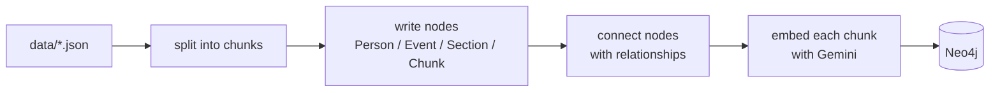
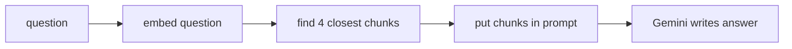
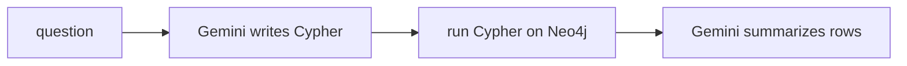

# Flow

Two phases: **load data in** (`prep.ipynb`), then **ask questions** (`main.ipynb`).

---

## 1. Ingestion — getting data into Neo4j



### What happens at each step

| # | Step | Function / file | Tool used | Details |
|---|------|-----------------|-----------|---------|
| 1 | Read the JSON | `open() + json.load` in `split_data_from_file` (`KG/chunking.py`) | Python stdlib | each file is `{ "section name": "long text" }` |
| 2 | Chunk the text | `split_data_from_file` (`KG/chunking.py`) | `RecursiveCharacterTextSplitter` (`langchain-text-splitters`) | `chunk_size=2000`, `chunk_overlap=200` chars |
| 3 | Create nodes | `create_nodes`, `ingest_Chunks` (`KG/kg.py`) | Cypher `MERGE` via `langchain-neo4j` `Neo4jGraph` | 1 `Person`/`Event` per file, 1 `Section` per JSON key, 1 `Chunk` per piece (unique on `chunkId`) |
| 4 | Connect nodes | `create_relationship` (`KG/kg.py`) | Cypher `MATCH … MERGE` | `Section→Chunk`, `Person→Section`, `Event→Section`, `Person↔Person`, `Person↔Event` |
| 5a | Create vector index | `create_vector_index` (`KG/kg.py`) | Neo4j `CREATE VECTOR INDEX` | name `Chunk`, on `n.textEmbedding`, **768 dims, cosine** |
| 5b | Embed chunks | `embed_text` (`KG/kg.py`) | **Gemini `gemini-embedding-001`** via `google-genai` | task `RETRIEVAL_DOCUMENT`, **768 dims**, L2-normalized, batched 32, backoff on 429; written with `db.create.setNodeVectorProperty` |

Connection: `load_neo4j_graph()` (`KG/config.py`) → Neo4j Aura, database `3663f87a`.

### The code

```python
# prep.ipynb, simplified
graph, gemini_api, _ = load_neo4j_graph()                # KG/config.py -> Neo4j Aura

for name in ["Talleyrand", "Napoleon", "Battle_of_Waterloo"]:
    chunks = split_data_from_file(f"data/{name}.json")   # 1 + 2  (RecursiveCharacterTextSplitter)
    data   = json.load(open(f"data/{name}.json"))
    label  = "Event" if name == "Battle_of_Waterloo" else "Person"
    create_nodes(graph, data, label, name)               # 3      (MERGE Person/Event + Section)
    ingest_Chunks(graph, chunks, name, "Chunk")          # 3      (MERGE Chunk on chunkId)

for q in relationship_queries:
    create_relationship(graph, q)                        # 4      (MATCH ... MERGE edges)

create_vector_index(graph, "Chunk")                      # 5a     (768-dim cosine index)
embed_text(graph, gemini_api, "Chunk", batch_size=32)    # 5b     (Gemini gemini-embedding-001, 768d)
```

---

## 2. Vector RAG — answer from chunk text



### What happens at each step

| # | Step | Where | Tool used | Details |
|---|------|-------|-----------|---------|
| 1 | Connect to the index | `Neo4jVector.from_existing_graph` (`vectorRAG.py`) | `langchain-neo4j` | points at index `Chunk`, text prop `text`, vector prop `textEmbedding` |
| 2 | Embed the question | same call's `embedding=` | **Gemini `gemini-embedding-001`** via `langchain-google-genai` `GoogleGenerativeAIEmbeddings` | task `RETRIEVAL_QUERY`, **768 dims** (must match the stored vectors) |
| 3 | Find nearest chunks | `.as_retriever(search_kwargs={"k": 4}).invoke(...)` | Neo4j `db.index.vector.queryNodes` | top **4** by cosine similarity |
| 4 | Build context | `"\n\n".join(...)` | plain Python | concatenate the 4 chunk texts |
| 5 | Write the answer | `prompt \| llm \| StrOutputParser()` | **Gemini `gemini-3.6-flash`** via `ChatGoogleGenerativeAI`, LCEL chain | system rule: answer only from context, else "I don't know"; `StrOutputParser` flattens Gemini's list-shaped output; `textwrap.fill(60)` wraps it |

### The code

```python
# vectorRAG.py, simplified
def query_vector_rag(question, ...):
    store = Neo4jVector.from_existing_graph(                               # 1
        embedding=GoogleGenerativeAIEmbeddings(                           # 2  Gemini gemini-embedding-001, 768d
            model="models/gemini-embedding-001",
            task_type="RETRIEVAL_QUERY", output_dimensionality=768),
        index_name="Chunk", ...)
    chunks  = store.as_retriever(search_kwargs={"k": 4}).invoke(question) # 3  top-4 by cosine
    context = "\n\n".join(c.page_content for c in chunks)                 # 4

    prompt = "Answer using only this context:\n{context}\n\nQ: {input}"
    chain  = prompt | ChatGoogleGenerativeAI(model="gemini-3.6-flash") | StrOutputParser()  # 5
    return textwrap.fill(chain.invoke({"context": context, "input": question}), 60)
```

---

## 3. Graph RAG — answer with a generated query



### What happens at each step

| # | Step | Where | Tool used | Details |
|---|------|-------|-----------|---------|
| 1 | Collect real names | `_entity_name_catalog(graph)` (`GraphRAG.py`) | Cypher `MATCH (n) WHERE n:Person OR n:Event` | so the LLM uses `Napoleon`, `Battle_of_Waterloo`, … and doesn't invent slugs |
| 2 | Build the prompt | `PromptTemplate` (`langchain-core`) | `CYPHER_GENERATION_TEMPLATE` | fills in `{schema}` (from Neo4j), `{question}`, `{entity_names}` |
| 3 | Write + run + summarize | `GraphCypherQAChain.from_llm(...)` (`langchain-neo4j`) | **Gemini `gemini-3.6-flash`** via `ChatGoogleGenerativeAI` | chain internally: LLM writes Cypher → runs it on `graph` → LLM turns rows into a sentence. `allow_dangerous_requests=True` because LLM-written Cypher runs on the DB |
| 4 | Format | `textwrap.fill(response["result"], 60)` | plain Python | wrap to 60 columns |

### The code

```python
# GraphRAG.py, simplified
def generate_cypher_query(question, graph):
    names  = _entity_name_catalog(graph)                       # 1  real Person/Event names
    prompt = PromptTemplate(template=CYPHER_GENERATION_TEMPLATE,
                            partial_variables={"entity_names": names})   # 2

    chain = GraphCypherQAChain.from_llm(                       # 3  Gemini gemini-3.6-flash
        ChatGoogleGenerativeAI(model="gemini-3.6-flash"),
        graph=graph, cypher_prompt=prompt,
        allow_dangerous_requests=True)
    return textwrap.fill(chain.invoke({"query": question})["result"], 60)   # 4
```

---

## 4. Which one to use

| Ask this way | Use | Why |
|---|---|---|
| "What did Napoleon reform?" (facts in prose) | **Vector RAG** | searches the actual chunk text |
| "How many Person nodes?" / "Who is linked to Waterloo?" (structure) | **Graph RAG** | runs a real query over the graph |

Vector RAG sees anything written in the text (even people with no node, like
Wellington). Graph RAG only knows the nodes you built, but its answers are exact.
The planned next step is to run both and feed both results into one final prompt.

---

## Tools at a glance

| Job | Tool |
|---|---|
| Graph database | Neo4j Aura Free (db `3663f87a`) |
| Chunking | `RecursiveCharacterTextSplitter` (2000 / 200) |
| Embeddings | Gemini `gemini-embedding-001`, 768 dims, cosine |
| LLM (answers + Cypher) | Gemini `gemini-3.6-flash` |
| Orchestration | LangChain v1.4 + `langchain-neo4j` + `langchain-google-genai` |
| Config / secrets | `python-dotenv` reading `.env` |
