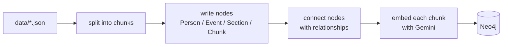
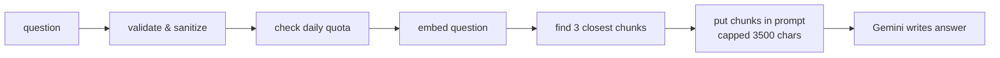
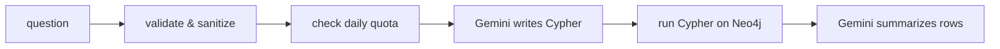

# Flow

Two phases: **load data in** (`prep.ipynb`), then **ask questions** (`main.ipynb`).

---

## 1. Ingestion — getting data into Neo4j



### What happens at each step

| # | Step | Function / file | Tool used | Details |
|---|------|-----------------|-----------|---------|
| 1 | Read the JSON | `open() + json.load` in `split_data_from_file` (`KG/chunking.py`) | Python stdlib | each file is `{ "section name": "long text" }` |
| 2 | Chunk the text | `split_data_from_file` (`KG/chunking.py`) | `RecursiveCharacterTextSplitter` (`langchain-text-splitters`) | `chunk_size=2000`, `chunk_overlap=200` chars |
| 3 | Create nodes | `create_nodes`, `ingest_Chunks` (`KG/kg.py`) | Cypher `MERGE` via `langchain-neo4j` `Neo4jGraph` | 1 `Person`/`Event` per file, 1 `Section` per JSON key, 1 `Chunk` per piece (unique on `chunkId`) |
| 4 | Connect nodes | `create_relationship` (`KG/kg.py`) | Cypher `MATCH … MERGE` | `Section→Chunk`, `Person→Section`, `Event→Section`, `Person↔Person`, `Person↔Event` |
| 5a | Create vector index | `create_vector_index` (`KG/kg.py`) | Neo4j `CREATE VECTOR INDEX` | name `Chunk`, on `n.textEmbedding`, **768 dims, cosine** |
| 5b | Embed chunks | `embed_text` (`KG/kg.py`) | **Gemini `gemini-embedding-001`** via `google-genai` | task `RETRIEVAL_DOCUMENT`, **768 dims**, L2-normalized, batched 32, backoff on 429; written with `db.create.setNodeVectorProperty` |

Connection: `load_neo4j_graph()` (`KG/config.py`) → Neo4j Aura, database `3663f87a`.

### The code

```python
# prep.ipynb, simplified
graph, gemini_api, _ = load_neo4j_graph()                # KG/config.py -> Neo4j Aura

for name in ["Talleyrand", "Napoleon", "Battle_of_Waterloo"]:
    chunks = split_data_from_file(f"data/{name}.json")   # 1 + 2  (RecursiveCharacterTextSplitter)
    data   = json.load(open(f"data/{name}.json"))
    label  = "Event" if name == "Battle_of_Waterloo" else "Person"
    create_nodes(graph, data, label, name)               # 3      (MERGE Person/Event + Section)
    ingest_Chunks(graph, chunks, name, "Chunk")          # 3      (MERGE Chunk on chunkId)

for q in relationship_queries:
    create_relationship(graph, q)                        # 4      (MATCH ... MERGE edges)

create_vector_index(graph, "Chunk")                      # 5a     (768-dim cosine index)
embed_text(graph, gemini_api, "Chunk", batch_size=32)    # 5b     (Gemini gemini-embedding-001, 768d)
```

---

## 2. Vector RAG — answer from chunk text



### What happens at each step

| # | Step | Where | Tool used | Details |
|---|------|-------|-----------|---------|
| 0 | Validate & sanitize | `_validate_and_sanitize_question` (`VectorRAG.py`) | plain Python | **guardrail**: rejects empty input and anything over 300 chars, strips `\r\n\t` |
| 1 | Check daily quota | `daily_limiter.check_and_increment()` (`VectorRAG.py`) | plain Python `PersistentDailyQuotaTracker`, backed by `.daily_quota.json` | **guardrail**: raises `RuntimeError` once today's request count reaches `max_rpd` (250); shared with `GraphRAG.py` and survives a kernel restart |
| 2 | Connect to the index | `Neo4jVector.from_existing_graph` (`VectorRAG.py`) | `langchain-neo4j` | points at index `Chunk`, text prop `text`, vector prop `textEmbedding` |
| 3 | Embed the question | same call's `embedding=` | **Gemini `gemini-embedding-001`** via `langchain-google-genai` `GoogleGenerativeAIEmbeddings` | task `RETRIEVAL_QUERY`, **768 dims** (must match the stored vectors) |
| 4 | Find nearest chunks | `.as_retriever(search_kwargs={"k": 3}).invoke(...)` | Neo4j `db.index.vector.queryNodes` | top **3** by cosine similarity — capped at 3 (was 4) as a cost guardrail |
| 5 | Build context | `"\n\n".join(...)`, then truncate | plain Python | **guardrail**: context string hard-capped at 3500 chars to bound the prompt sent to the LLM |
| 6 | Write the answer | `prompt \| llm \| StrOutputParser()` | **Gemini `gemini-3.5-flash-lite`** via `ChatGoogleGenerativeAI`, LCEL chain | system rule: answer only from context, else "I don't know"; the human message wraps the question in `<user_input>` tags marked untrusted (**prompt-injection guardrail**); `StrOutputParser` flattens Gemini's list-shaped output; `textwrap.fill(60)` wraps it |

### The code

```python
# VectorRAG.py, simplified
def query_vector_rag(question, ...):
    question = _validate_and_sanitize_question(question)                  # 0  guardrail
    daily_limiter.check_and_increment()                                   # 1  guardrail (RPD cap)

    store = Neo4jVector.from_existing_graph(                               # 2
        embedding=GoogleGenerativeAIEmbeddings(                           # 3  Gemini gemini-embedding-001, 768d
            model="models/gemini-embedding-001",
            task_type="RETRIEVAL_QUERY", output_dimensionality=768),
        index_name="Chunk", ...)
    chunks  = store.as_retriever(search_kwargs={"k": 3}).invoke(question) # 4  top-3 by cosine
    context = "\n\n".join(c.page_content for c in chunks)[:3500]          # 5  capped

    prompt = "...<user_input>{input}</user_input>..."                     # marks input untrusted
    chain  = prompt | ChatGoogleGenerativeAI(model="gemini-3.5-flash-lite") | StrOutputParser()  # 6
    result = chain.invoke({"context": context, "input": question})
    return textwrap.fill(result, 60)
```

---

## 3. Graph RAG — answer with a generated query



### What happens at each step

| # | Step | Where | Tool used | Details |
|---|------|-------|-----------|---------|
| 0 | Validate & sanitize | `_validate_and_sanitize_question` (`GraphRAG.py`) | plain Python | **guardrail**: same rule as Vector RAG — reject empty/>300 chars, strip `\r\n\t` |
| 1 | Check daily quota | `daily_limiter.check_and_increment()` (`GraphRAG.py`) | plain Python `PersistentDailyQuotaTracker`, backed by `.daily_quota.json` | **guardrail**: shared counter with `VectorRAG.py` — raises once today's combined count reaches `max_rpd` (250); survives a kernel restart |
| 2 | Collect real names | `_entity_name_catalog(graph)` (`GraphRAG.py`) | Cypher `MATCH (n) WHERE n:Person OR n:Event` | **guardrail**: allow-list so the LLM uses `Napoleon`, `Battle_of_Waterloo`, … and doesn't invent slugs |
| 3 | Build the prompt | `PromptTemplate` (`langchain-core`) | `CYPHER_GENERATION_TEMPLATE` | fills in `{schema}` (from Neo4j), `{entity_names}`, few-shot examples, and wraps `{question}` in `<user_question>` tags marked untrusted (**prompt-injection guardrail**) |
| 4 | Write + run + summarize | `GraphCypherQAChain.from_llm(...)` (`langchain-neo4j`) | **Gemini `gemini-3.5-flash-lite`** via `ChatGoogleGenerativeAI` | chain internally: LLM writes Cypher → runs it on `graph` → LLM turns rows into a sentence. `allow_dangerous_requests=True`, and no check runs before execution — `_enforce_readonly_cypher()`/`_ensure_cypher_limit()` exist in this file but are **never called** (dead code), see `docs/Guardrails.md` |
| 5 | Format | `textwrap.fill(response["result"], 60)` | plain Python | wrap to 60 columns |

### The code

```python
# GraphRAG.py, simplified
def generate_cypher_query(question, graph):
    question = _validate_and_sanitize_question(question)          # 0  guardrail
    daily_limiter.check_and_increment()                           # 1  guardrail (RPD cap)

    names  = _entity_name_catalog(graph)                          # 2  real Person/Event names
    prompt = PromptTemplate(template=CYPHER_GENERATION_TEMPLATE,   # 3  {question} wrapped as untrusted
                            partial_variables={"entity_names": names})

    chain = GraphCypherQAChain.from_llm(                          # 4  Gemini gemini-3.5-flash-lite
        ChatGoogleGenerativeAI(model="gemini-3.5-flash-lite"),
        graph=graph, cypher_prompt=prompt,
        allow_dangerous_requests=True)
    result = chain.invoke({"query": question})["result"]
    return textwrap.fill(result, 60)                                # 5
```

---

## 4. Which one to use

| Ask this way | Use | Why |
|---|---|---|
| "What did Napoleon reform?" (facts in prose) | **Vector RAG** | searches the actual chunk text |
| "How many Person nodes?" / "Who is linked to Waterloo?" (structure) | **Graph RAG** | runs a real query over the graph |

Vector RAG sees anything written in the text (even people with no node, like
Wellington). Graph RAG only knows the nodes you built, but its answers are exact.
The planned next step is to run both and feed both results into one final prompt.

---

## Tools at a glance

| Job | Tool |
|---|---|
| Graph database | Neo4j Aura Free (db `3663f87a`) |
| Chunking | `RecursiveCharacterTextSplitter` (2000 / 200) |
| Embeddings | Gemini `gemini-embedding-001`, 768 dims, cosine |
| LLM (answers + Cypher) | Gemini `gemini-3.5-flash-lite` |
| Orchestration | LangChain v1.4 + `langchain-neo4j` + `langchain-google-genai` |
| Config / secrets | `python-dotenv` reading `.env`; connection errors sanitized before they leave `KG/config.py` |

Guardrails (input validation, prompt-injection isolation, cost caps, error
masking) are covered step-by-step above and summarized in
**[Guardrails.md](Guardrails.md)**.
