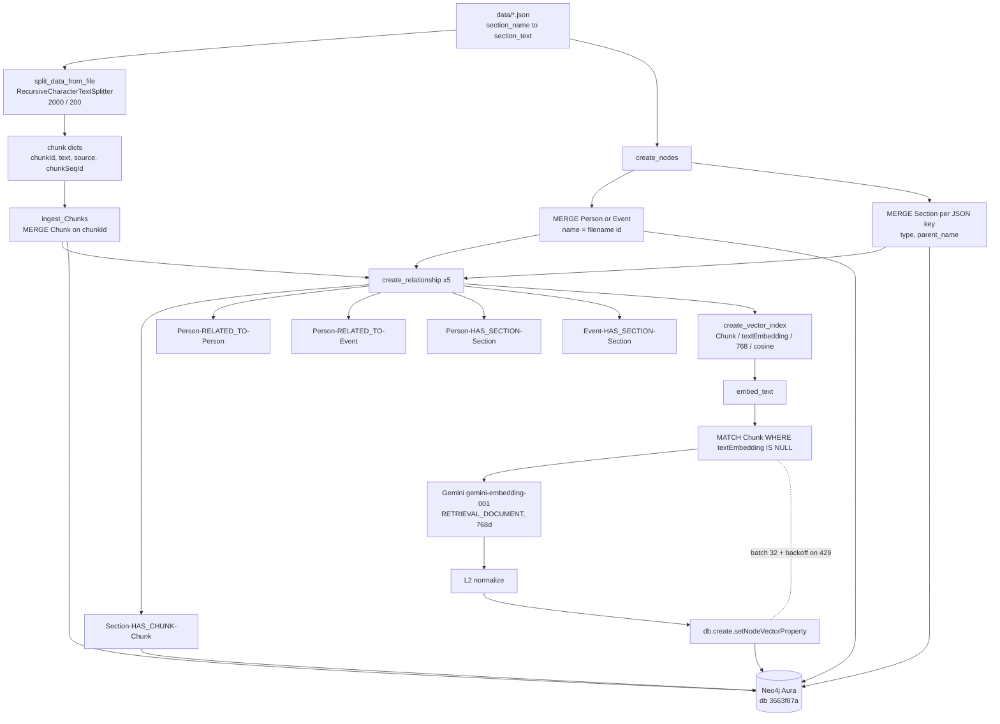
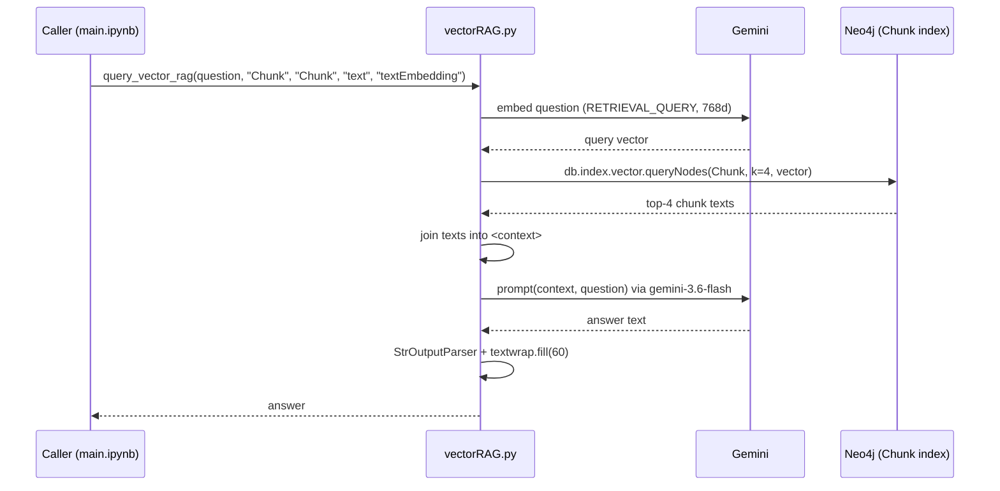
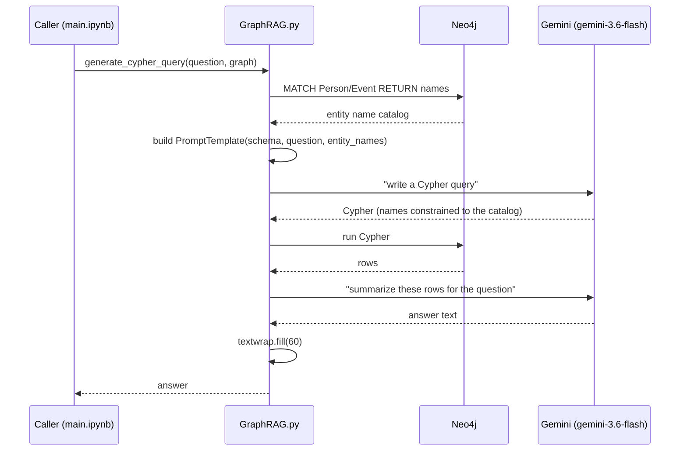

# Flow

Data and control flow for both phases. Diagrams are Mermaid — GitHub renders
them inline.

---

## 1. Ingestion flow (`prep.ipynb`)

Idempotent: nodes `MERGE` on keys; `embed_text` skips chunks that already have
`textEmbedding`.

---

## 2. Vector RAG query flow (`query_vector_rag`)

Prompt rule: answer **only** from `<context>`; otherwise "I don't know".

---

## 3. Graph RAG query flow (`generate_cypher_query`)

`allow_dangerous_requests=True` is required because the LLM-authored Cypher runs
directly against the database.

---

## 4. How the two paths differ

| | Vector RAG | Graph RAG |
|---|---|---|
| Retrieves | chunk **text** by semantic similarity | **rows** via generated Cypher |
| Knows about | anything written in the prose (e.g. Wellington, Blücher) | only modelled nodes (Talleyrand, Napoleon, Battle_of_Waterloo) |
| Best question | "What reforms did Napoleon introduce?" | "How many Person nodes are there?" / "Who is related to Battle_of_Waterloo?" |
| Failure mode | misses facts not in the top-k chunks | empty result if Cypher name/shape is wrong |

The intended hybrid step: run both, feed vector chunks **and** Cypher rows into
one final Gemini prompt.
